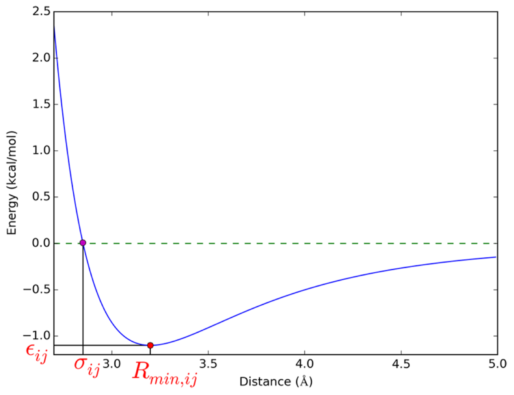

# Symbolic Regression Study on Lennard-Jones potential

## Overview
LJ potential is a classic potential that describe the interaction between two atoms.

A classic form of LJ potential is the 12-6 form

$$V_{ij}= 4 \epsilon_{ij}[(\frac {\sigma_{ij}} {r_{ij}})^{12} - (\frac {\sigma_{ij}} {r_{ij}})^{6}]$$

## Goal
Fit LJ potential equations using Symbolic regression

## LJ potential

A typical LJ potential profile is:

